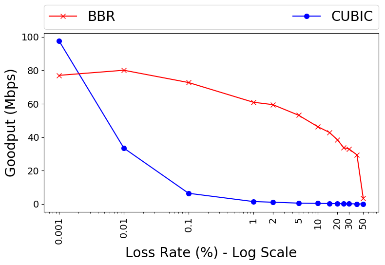
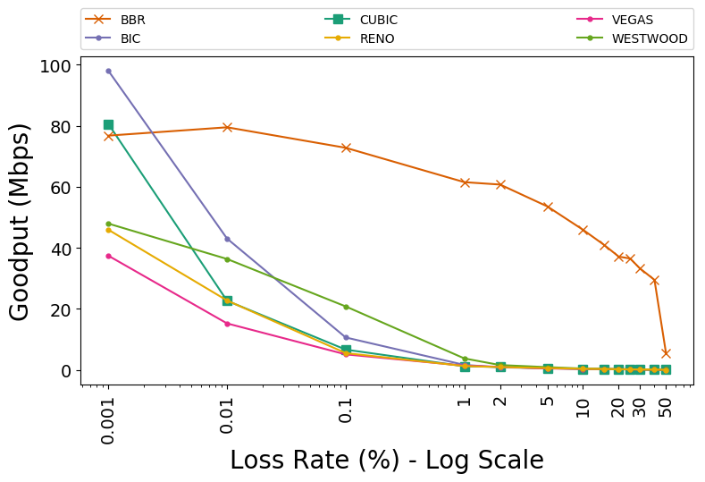
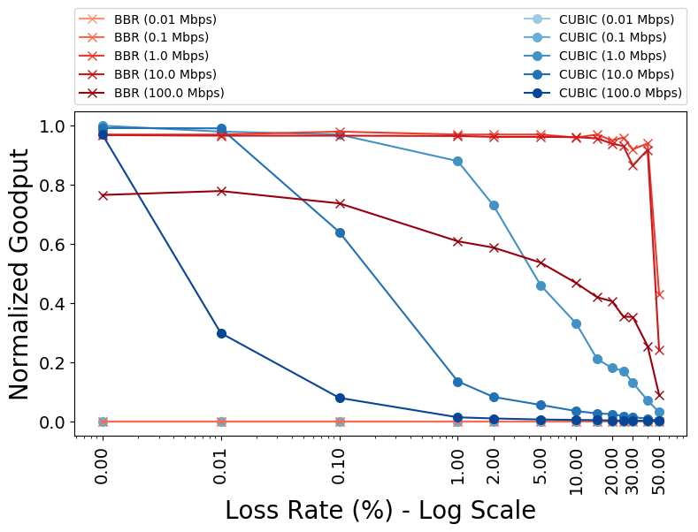
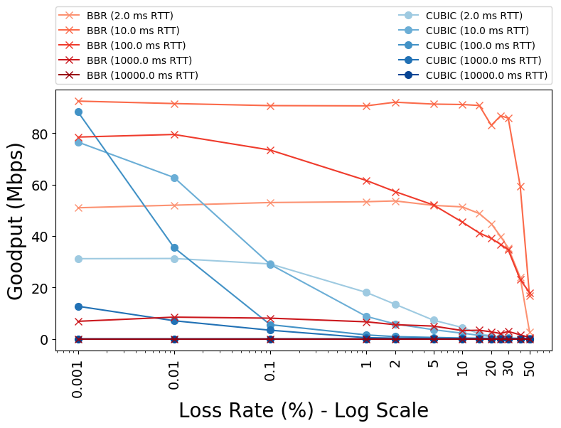
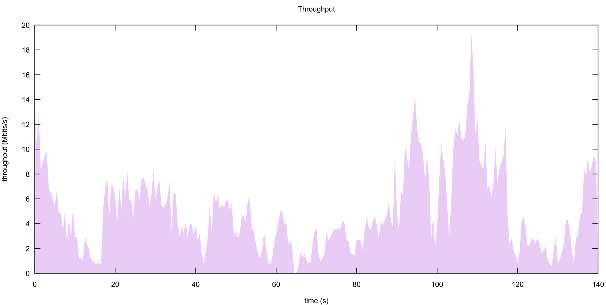
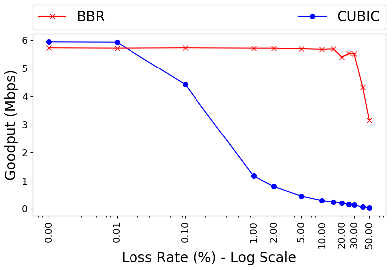

## ReBBR: Reproducing BBR Performance on Lossy Networks

 
 
 
 
 

<small>Luke Hsiao and Jervis Muindi</small>  
<small>June 2017<small>

---

### Introduction: BBR Congestion-based Congestion Control  

- Tries to maximize throughput and minimize latency
- Does so by estimating the bottleneck bandwidth and round-trip propagation
  delay
- Deployed in Google's B4 datacenter-to-datacenter high-speed WAN which uses
  commodity switches.

---?image=http://deliveryimages.acm.org/10.1145/3030000/3022184/vanjacobson1.png

---

### Sub-Result: BBR performs better than CUBIC in Lossy Networks  
- We focus on the claim that BBR is better than CUBIC in networks with
  non-negligible loss rates.
- Illustrates one of the most obvious differences between a loss-based
  congestion control algorithm and a congestion-based algorithm.
- CUBIC's loss tolerance is a property of the algorithm. BBR's loss tolerance
  is a configuration parameter.
- 2-25x improvement in throughput on Google's B4.

---

<small>
BBR vs. CUBIC throughput for 60-second flows on a 100Mbps/100-ms link with
0.001% to 50% random loss.
</small>

---

### Experimental Setup  
- Ubuntu 16.04 LTS VM with [v4.11.1](http://kernel.ubuntu.com/~kernel-ppa/mainline/v4.11.1/) of the Linux kernel
- [Mahimahi](http://mahimahi.mit.edu/) Network Emulator
  - Infinite buffer on bottleneck link
- Google Cloud `n1-standard-2` instance
- 6.25MB maximum send and receive window sizes
- Python client process sending stream of data to a python server process over emulated link.

---

### Reproducing Figure 8

+++

+++
#### Our Results
- CUBIC achieves slightly better throughput than BBR for extremely low loss rates.
- BBR throughput does not drop until about 45% loss unlike the original paper.
    - This is likely due to a difference in the implementation of the loss
      process in Mahimahi vs. the `netem`-based emulation used by the authors.

Note:
Specifically, there are two possible factors: (1) the size of the initial
congestion window can result in the current BBR code pacing packets one RTT
later than CUBIC would (discussed in this developer thread), and (2) the
current implementation of the ProbeRTT mechanism prioritized simplicity over
performance, which can result in ~2% penalty in throughput because BBR spends
those portions of time with a minimal number of packets in flight.
Differences in emulation: level of correlation of drops, or number of packets
dropped at the same time (LRO/GRO settings).

---

### Exploration Experiments
- Comparing BBR to other TCP congestion control algorithms
- Evaluating the effect of bottleneck bandwidth and round trip time
- BBR vs. CUBIC on a Verizon LTE Trace

---

### BBR vs. Other TCP Congestion Control

NOTE:
BIC designed for "long fat networks" while Westwood was designed
for high BDP with potential packet loss. Evaluated on 30-second flows.

---

### Evaluating Effect of BW and RTT

 
 

How does BBR compare against CUBIC for different bottleneck bandwidths
and different RTT values?

+++
#### Varying Bottleneck Bandwidth

NOTE:
Performed on 30-second flows. Some of the variance for the low-throughput
lines could be address by using smaller maximum buffer sizes.

+++
#### Varying Round Trip Time

NOTE:
Performed on 120-second flows. The decreasing BWs are mainly a result of the
longer time spent in start up. Longer flow simulations could address this.

---
### BBR vs CUBIC on a Cellular Link

All other experiments had fixed bandwidths and delays. How does BBR compare to
CUBIC when these values change over time?

Experiment using the 140-second Verizon LTE trace provided with Mahimahi.

+++

+++

+++

---

### Challenges
- Default send and receive buffer maximums in Ubuntu can skew results.
- Initially, deadlock could occur between our Python client and server processes.

---

### Summary
- Our experiments support the claim of the original paper: in general, BBR
  performs better than CUBIC for non-negligible loss rates.
- We find that this behavior holds true across varied bandwidths and RTTs
- Reproduce our results using [our GitHub repository](https://github.com/jervisfm/rebbr#step-by-step-instructions).
  - It takes about 8.5 hours to run all experiments.
