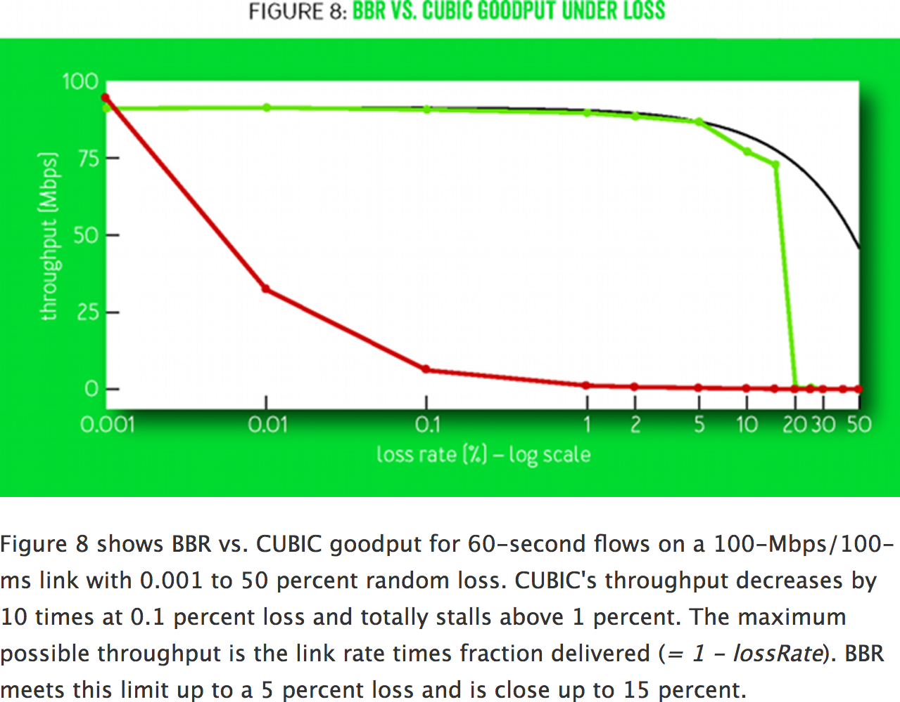

# Introduction

This is a project to reproduce Google BBR network performance results over lossy network links.

Link to paper: https://research.google.com/pubs/pub45646.html

## Collaborators
* Jervis
* Luke

# Figure To Reproduce

The figure we are interested in reproducing is Figure 8 that shows BBR performance over lossy links
when compared to [CUBIC](https://en.wikipedia.org/wiki/CUBIC_TCP). This figure is shown below:





# Setup

The highlevel approach is:

1) Setup a Virtual Machine with BBR enabled.
2) Install Mahimahi Emulations tools
3) Use LinkShell and DelayShells to simulate differing amount of losses.


## Step 1: VM Setup

For this part, we'll use the guide published by Google here: https://github.com/google/bbr/blob/master/Documentation/bbr-quick-start.md
as a start.

Prerequisites:
* GCloud SDK: https://cloud.google.com/sdk/downloads
* Cloud Account with Billing enabled.

Initialize the GCloud SDK if this is the first time installing it. This will authenticate
your google account and set default project/zone.
```
$ gcloud init
```

Visit http://cloud.google.com and create a new project to run the experiment in.
TODO(jmuindi): Figure out what the matching CLI syntax is for project creation automation.


After successful project creation, you can list available projects like so:

```
$ gcloud projects list
PROJECT_ID            NAME        PROJECT_NUMBER
extreme-braid-167301  google-bbr  142604555723
```

Then set the defaults for PROJECT and ZONE like so:

```
$ typeset -x PROJECT="<USE_YOUR_PROJECT_ID>"
$ typeset -x ZONE="us-west1-a"
```

Then Create the VM Instance:

```bash
$ gcloud compute   instances create "bbrtest1"   --project ${PROJECT} --zone ${ZONE}   --machine-type "n1-standard-8"   --network "default"   --maintenance-policy "MIGRATE"   --boot-disk-type "pd-standard"   --boot-disk-device-name "bbrtest1"   --image-project "ubuntu-os-cloud" --image "ubuntu-1604-xenial-v20160922"   --boot-disk-size "20"   --scopes default="https://www.googleapis.com/auth/devstorage.read_only","https://www.googleapis.com/auth/logging.write","https://www.googleapis.com/auth/monitoring.write","https://www.googleapis.com/auth/servicecontrol","https://www.googleapis.com/auth/service.management.readonly"
```

You can ignore warning about poor I/O performance.. Upon success, you should see:
```
Created [https://www.googleapis.com/compute/v1/projects/extreme-braid-167301/zones/us-west1-a/instances/bbrtest1].
NAME      ZONE        MACHINE_TYPE   PREEMPTIBLE  INTERNAL_IP  EXTERNAL_IP     STATUS
bbrtest1  us-west1-a  n1-standard-8               X.X.X.X        X.X.X.X       RUNNING
```

Login into the VM
```
$ gcloud compute ssh --project ${PROJECT} --zone ${ZONE} bbrtest1
$ sudo apt-get update
$ sudo apt-get build-dep linux
$ sudo apt-get upgrade
```

From here on out, you can safely follow instructions from: https://github.com/google/bbr/blob/master/Documentation/bbr-quick-start.md#obtain-kernel-sources-with-tcp-bbr


### Running Appendix Notes:

Executing vanilla gcloud compute after install Gcloud SDK command results in an error:
```
gcloud compute \
>   instances create "bbrtest1" \
>   --project ${PROJECT} --zone ${ZONE} \
>   --machine-type "n1-standard-8" \
>   --network "default" \
>   --maintenance-policy "MIGRATE" \
>   --boot-disk-type "pd-standard" \
>   --boot-disk-device-name "bbrtest1" \
>   --image "/ubuntu-os-cloud/ubuntu-1604-xenial-v20160922" \
>   --boot-disk-size "20" \
>   --scopes default="https://www.googleapis.com/auth/devstorage.read_only","https://www.googleapis.com/auth/logging.write","https://www.googleapis.com/auth/monitoring.write","https://www.googleapis.com/auth/servicecontrol","https://www.googleapis.com/auth/service.management.readonly"
WARNING: You have selected a disk size of under [200GB]. This may result in poor I/O performance. For more information, see: https://developers.google.com/compute/docs/disks#pdperformance.
WARNING: Flag format --scopes [ACCOUNT=]SCOPE, [[ACCOUNT=]SCOPE, ...] is deprecated and will be removed 24th Jan 2018. Use --scopes SCOPE[, SCOPE...] --service-account ACCOUNT instead.
ERROR: (gcloud.compute.instances.create) Could not fetch resource:
 - Invalid value for field 'resource.disks[0].initializeParams.sourceImage': 'https://www.googleapis.com/compute/v1/projects/make-tcp-fast/global/images//ubuntu-os-cloud/ubuntu-1604-xenial-v20160922'. The URL is malformed.
```

From docs here: https://cloud.google.com/sdk/gcloud/reference/compute/instances/create, it says we can find available names with:

```
$ gcloud compute images list
```

Available ubuntu images are:
```
ubuntu-1404-trusty-v20170505                      ubuntu-os-cloud    ubuntu-1404-lts                       READY
ubuntu-1604-xenial-v20170502                      ubuntu-os-cloud    ubuntu-1604-lts                       READY
ubuntu-1610-yakkety-v20170502                     ubuntu-os-cloud    ubuntu-1610                           READY
ubuntu-1704-zesty-v20170413                       ubuntu-os-cloud    ubuntu-1704                           READY
```

However, even using ubuntu-1604-xenial-v20170502 still errors out.

Ah, I tried running the example command on the doc and even that errors out still:
```
gcloud compute instances create example-instance \
      --image-family rhel-7 --image-project rhel-cloud \
      --zone us-central1-a
- Failed to find project google-bbr
```

So, it looks like project setup failed.

Ah, the problem looks to be a difference between project ID and project name. Create a project on the web (http://console.google.com)
and list available project like so:

```
$ gcloud projects list
PROJECT_ID            NAME        PROJECT_NUMBER
extreme-braid-167301  google-bbr  142604555723
```

Then Update your local project config:
```
$ gcloud config set project extreme-braid-167301
```

This is a bit wierd since the project ids are machine generated and don't have memorable names.

Next up, you need to enable Billing to do actual sort of action. You can use the Education credit available here: https://goo.gl/gcpedu/omXu3b as
a Billing source.

With that, can create an Instance following GCloud example command.


But the BBR VM create command is still failing. It cannot find the VM image:
```
ERROR: (gcloud.compute.instances.create) Could not fetch resource:
 - Invalid value for field 'resource.disks[0].initializeParams.sourceImage': 'https://www.googleapis.com/compute/v1/projects/extreme-braid-167301/global/images//ubuntu-os-cloud/ubuntu-1604-xenial-v20160922'. The URL is malformed.
```

Created minimal failing cli command test case:
```
$ gcloud compute  instances create "bbrtest1"   --image "/ubuntu-os-cloud/ubuntu-1604-xenial-v20160922"
ERROR: (gcloud.compute.instances.create) Could not fetch resource:
 - Invalid value for field 'resource.disks[0].initializeParams.sourceImage': 'https://www.googleapis.com/compute/v1/projects/extreme-braid-167301/global/images//ubuntu-os-cloud/ubuntu-1604-xenial-v20160922'. The URL is malformed.
```


Iterating on that simpler example, I found new magic incantation to create a VM instance. It looks like the syntax might have changed
and you're now supposed to use the --image-project to specify which project image is from.

```
gcloud compute   instances create "bbrtest1"   --image "ubuntu-1604-xenial-v20170502"   --image-project "ubuntu-os-cloud"
```

Apply this to the BBR Create VM Command, we progress further but encouter another error:

```
ERROR: (gcloud.compute.instances.create) Could not fetch resource:
 - Required 'compute.networks.use' permission for 'projects/make-tcp-fast/global/networks/default'
```

Ah, the permission errors is because of referencing the wrong project. So either remove --project from argument list or
make sure that ```${PROJECT}``` refers to a valid GCloud Project ID. Note this is the ID and _not_ the name. With that,
was able to stand up a VM.

I will note a useful command for deleting the created VM is:

```
$ gcloud compute   instances delete "bbrtest1"
```


# WIP/LOCAL VM

VMWare to get a Ubuntu 16.04.2 VM.

Update to kernel v4.11.1

```bash
wget http://kernel.ubuntu.com/~kernel-ppa/mainline/v4.11.1/linux-headers-4.11.1-041101_4.11.1-041101.201705140931_all.deb
wget http://kernel.ubuntu.com/~kernel-ppa/mainline/v4.11.1/linux-headers-4.11.1-041101-generic_4.11.1-041101.201705140931_amd64.deb
wget http://kernel.ubuntu.com/~kernel-ppa/mainline/v4.11.1/linux-image-4.11.1-041101-generic_4.11.1-041101.201705140931_amd64.deb
```

Install
```
sudo dpkg -i *.deb
```

Reboot. Check with:

```
uname -sr
```

# Python deps
* matplotlib

```
$ pip install matplotlib
```

* python-tk
```
$ sudo apt-get install python-tk
```